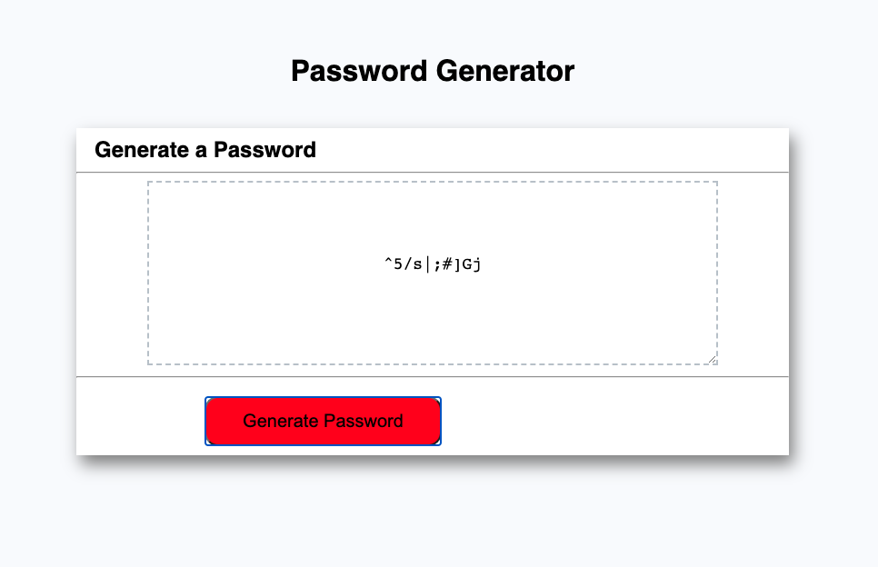

# Password Generator
This project has been deployed to GitHub pages and can be accessed using the links below.  The application emphasizes the use of JavaScript to generate a random password.

## Description
The following client wanted their application to generate a random password based on certain criteria that is powered by JavaScript.  The purpose of this password is to provide greater security given the client possesses sensitive data.  The password generated will be between 8-128 characters, including the following types: lowercase, uppercase, numeric, and/or special characters.

## Developer
The webpage will prompt a user a series of prompts and confirms after they select the 'Generate Password' button.  Once the user has entered in the requested information, a password will be generated using JavaScript.  The JavaScript consists of variables, including arrays and value placeholders, event listerns, and if/else statements.  The text area will display the password once it is generated.  The webpage has a responsive layout by utilizing media queries within the CSS file.  

**View the web page here:** 

## Mock-Up

The following image shows the web application's appearance and functionality after the user goes through all of the required prompts:

